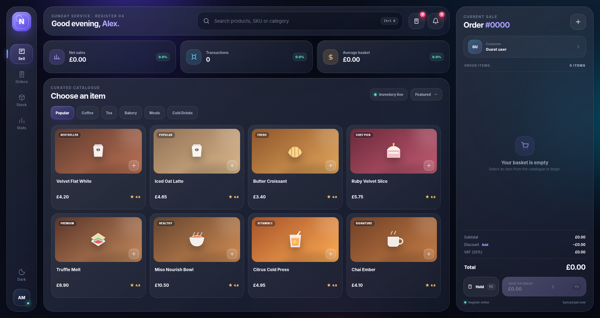
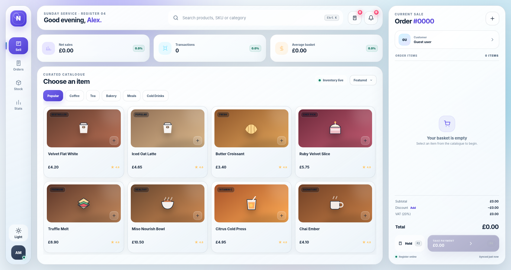

# NOVA POS 2026

A desktop-first point-of-sale interface built as a front-end portfolio and GitHub Pages demo. I designed NOVA POS with a glassmorphism visual system, liquid-glass controls, a structured product catalogue, live cart calculations, discounts, VAT, held orders, checkout interactions, and dark/light themes.

> **Demo purpose:** visitors can test the POS during a session. Transactional data is intended to exist only in browser memory and reset when the page is refreshed.

## Live Demo

After GitHub Pages is enabled, the project will be available at:

```text
https://umaisnasir.github.io/POS_System/
```

Repository:

```text
https://github.com/umaisnasir/POS_System
```

## Preview

### Nebula dark theme



### Lumen light theme



## Features

- Desktop-optimised POS layout for screens at least `1180px` wide
- Modern glassmorphism panels and liquid-glass controls
- Nebula dark theme and Lumen light theme
- Search by product name, SKU, category, or badge
- Category filters for Coffee, Tea, Bakery, Meals, and Cold Drinks
- Product sorting by featured order, price, or rating
- Add, remove, increase, and decrease cart quantities
- Automatic subtotal, discount, VAT, and total calculations
- Configurable discount interaction
- Hold, resume, and delete order workflows
- Card and cash payment simulation
- Zero-state dashboard for sales, transactions, and average basket
- Visible notification and held-order counters
- Toast notifications and keyboard navigation
- Keyboard shortcuts for search, held orders, and checkout

## Demo Data Behaviour

NOVA POS is intended to behave as a temporary public demo on GitHub Pages.

| Action | During the current visit | After browser refresh |
|---|---:|---:|
| Add or remove products | Preserved | Cleared |
| Change quantities | Preserved | Cleared |
| Apply a discount | Preserved | Cleared |
| Complete a payment | Dashboard values update | Reset to zero |
| Hold an order | Available during the visit | Cleared |
| Order number | Can increase during testing | Reset to `#0000` |
| Notifications | Can update during testing | Reset to `0` |

Initial state:

```text
Net sales:       £0.00
Transactions:    0
Average basket:  £0.00
Order:           #0000
Held orders:     0
Notifications:   0
Cart:            Empty
```

### Important implementation rule

For complete reset-on-refresh behaviour, transactional state must remain in JavaScript memory only.

Do **not** store the following values in `localStorage` or `sessionStorage`:

- Cart contents
- Completed sales
- Transaction count
- Average basket
- Order number
- Held orders
- Discounts
- Notification counts

`sessionStorage` is also unsuitable because it normally survives a standard page refresh.

The selected theme may be stored separately only when theme persistence is deliberately required.

## Keyboard Shortcuts

| Shortcut | Action |
|---|---|
| `Ctrl + K` | Focus product search |
| `F2` | Hold the current order |
| `F4` | Open payment checkout |
| `Escape` | Close an open dialog |

## Technology

- HTML5
- CSS3
- Vanilla JavaScript
- SVG interface icons
- Web Storage API only when optional non-transactional preferences are required
- GitHub Pages for static hosting

No framework, package manager, build process, backend, or database is required.

## Project Structure

```text
POS_System/
├── index.html
├── styles.css
├── app.js
├── README.md
├── BUILD-NOTES.md
├── TEST-REPORT.json
├── preview-dark-v3.png
├── preview-light-v3.png
└── tests/
    └── test_pos_v3.py
```

Keep `index.html`, `styles.css`, and `app.js` in the same directory. Moving or renaming one of them without updating the file references will break the interface.

## Run Locally

### Directly in a browser

Open `index.html` in a modern desktop browser.

### Through a local server

From the project directory, run:

```bash
python -m http.server 5500
```

Then open:

```text
http://localhost:5500
```

Using a local server is preferable because it behaves more like GitHub Pages than opening the page through a `file://` path.

## Deploy to GitHub Pages

1. Create a public GitHub repository named `POS_System`.
2. Upload the project files to the repository root.
3. Open the repository **Settings**.
4. Select **Pages**.
5. Under **Build and deployment**, choose **Deploy from a branch**.
6. Select the `main` branch and the `/ (root)` folder.
7. Save the configuration.
8. Wait for GitHub Pages to publish the site.

Expected deployment URL:

```text
https://umaisnasir.github.io/POS_System/
```

After deployment, perform a hard refresh once:

```text
Windows/Linux: Ctrl + Shift + R
macOS: Command + Shift + R
```

## Verification Checklist

Before publishing, verify the following behaviour:

- [ ] Every operational metric initially displays zero
- [ ] Cart totals update correctly when products are added or removed
- [ ] Quantity controls cannot create negative quantities
- [ ] Discount and VAT calculations remain accurate
- [ ] Checkout is disabled when the cart is empty
- [ ] Held orders can be resumed during the current visit
- [ ] Both themes visibly change the complete interface
- [ ] Notification counters remain visible when their value is zero
- [ ] Product cards have sufficient spacing below the price and rating
- [ ] Refreshing the page clears all transactional demo data
- [ ] No JavaScript errors appear in the browser console
- [ ] No page-level overlap or horizontal overflow appears at desktop widths

The interface has been visually checked at these desktop viewports:

```text
1280 × 720
1440 × 900
1692 × 896
1920 × 1080
```

## Limitations

This repository is a front-end demonstration, not a production POS system. It does not provide:

- Real payment processing
- User authentication or staff permissions
- Server-side storage
- Database-backed inventory
- Multi-device synchronisation
- Fiscal receipt compliance
- Secure audit logs
- Real customer records

Do not use it to process real sales or sensitive customer information.

## Production Roadmap

A production implementation would require a secure backend, authenticated staff accounts, database transactions, inventory reconciliation, payment-provider integration, receipt generation, audit logging, role-based permissions, offline recovery, and jurisdiction-specific tax compliance.

## Author

Built by **Muhammad Umais** as a modern front-end POS interface and portfolio project.
